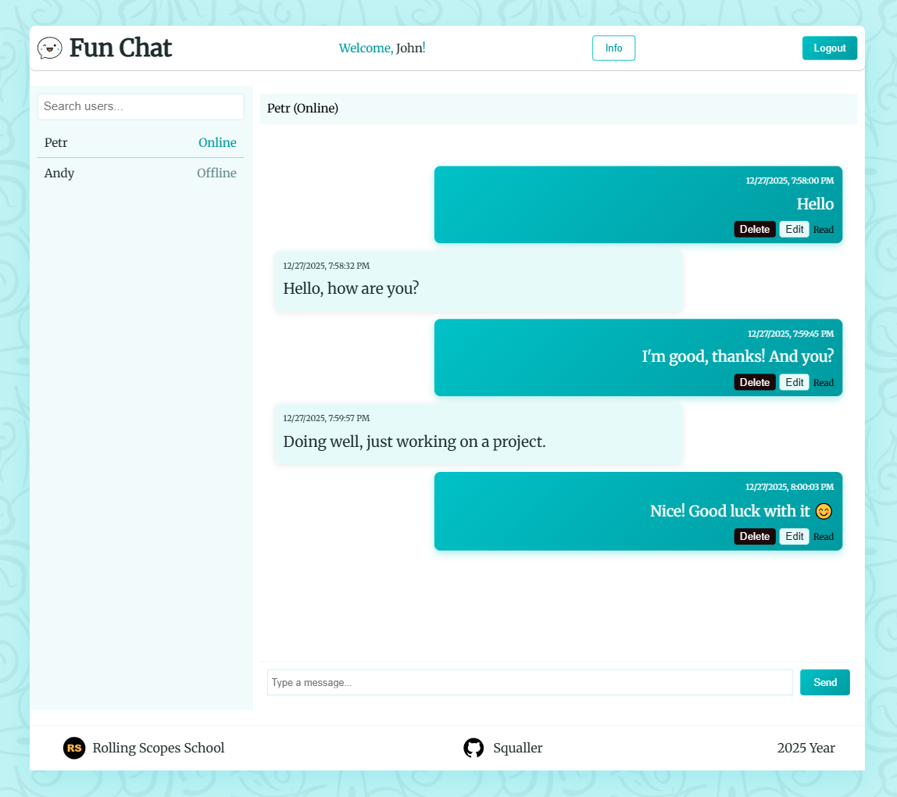

# Fun Chat

**Fun Chat** — a real-time chat web application with WebSocket support. Communicate with multiple users, see online status, and enjoy a clean, modern interface.

## 🌐 Live Demo
<a href="https://q-fun-chat.netlify.app/login" target="_blank">Netlify</a>

> Note: The application requires the backend WebSocket server to be running (see WebSocket server setup instructions below).

## 🖥️ Screenshots


## Features

- Real-time chat with WebSocket
- User presence (Online/Offline) and unread indicators
- Send, edit, delete messages with read/delivery status
- Search users and maintain chat history
- Login/logout with session management
- Responsive, modern interface with About page

## Tech Stack

* **TypeScript**
* **WebSocket server** (fun-chat-server)

## Prerequisites

Before running this application, you need to set up and run the backend WebSocket server. Instructions below.

### Backend Server Setup

This application requires the <a href="https://github.com/rolling-scopes-school/fun-chat-server" target="_blank">fun-chat-server</a> to be running locally.

1. **Clone the server repository:**
   ```bash
   git clone https://github.com/rolling-scopes-school/fun-chat-server.git

2. **Navigate to the API directory:**
   ```bash
   cd fun-chat-server
   ```

3. **Install dependencies:**
   ```bash
   npm install
   ```

4. **Start the WebSocket server:**
   ```bash
   npm start
   ```
✅ WebSocket Server is running on port 4000. You can now start the frontend application.

## Run Application Locally

1. **Clone the repository:**
   ```bash
   git clone https://github.com/SquallerQ/fun-chat.git
   cd fun-chat
   ```

2. **Install dependencies:**
   ```bash
   npm install
   ```

3. **Make sure the WebSocket server is running** (see Prerequisites above)

4. **Start the development server:**
   ```bash
   npm run dev
   ```

5. **Open the app in your browser**